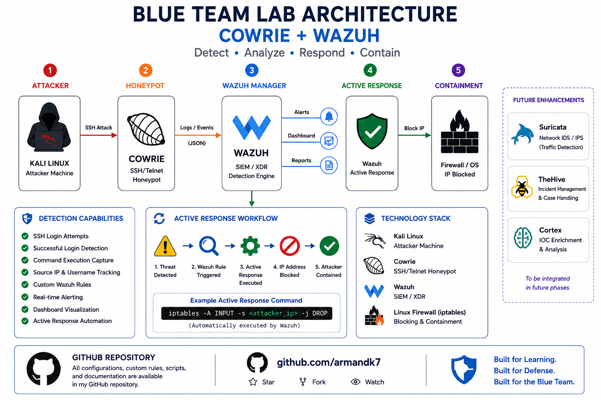
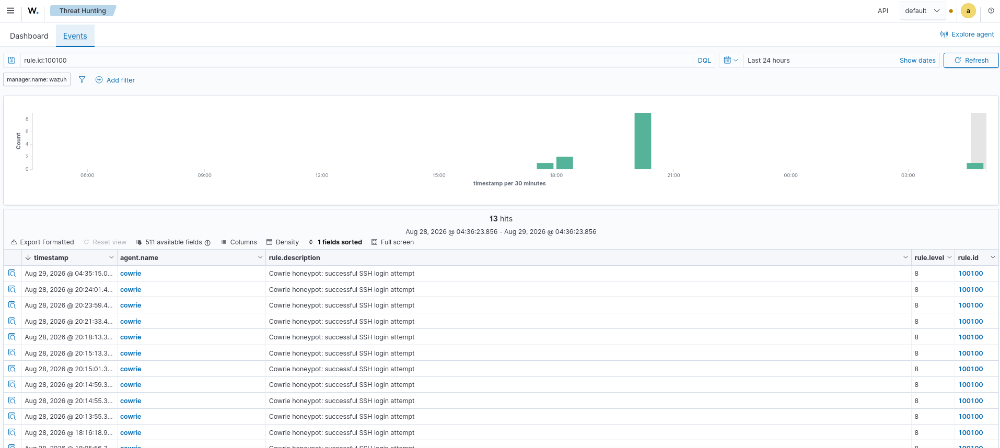
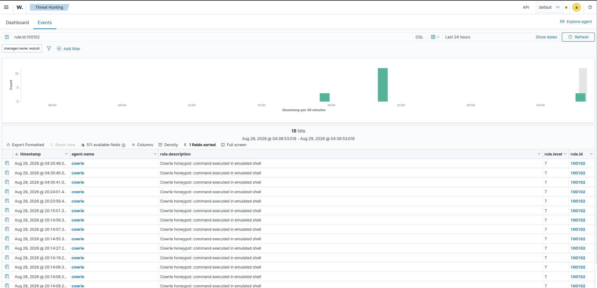
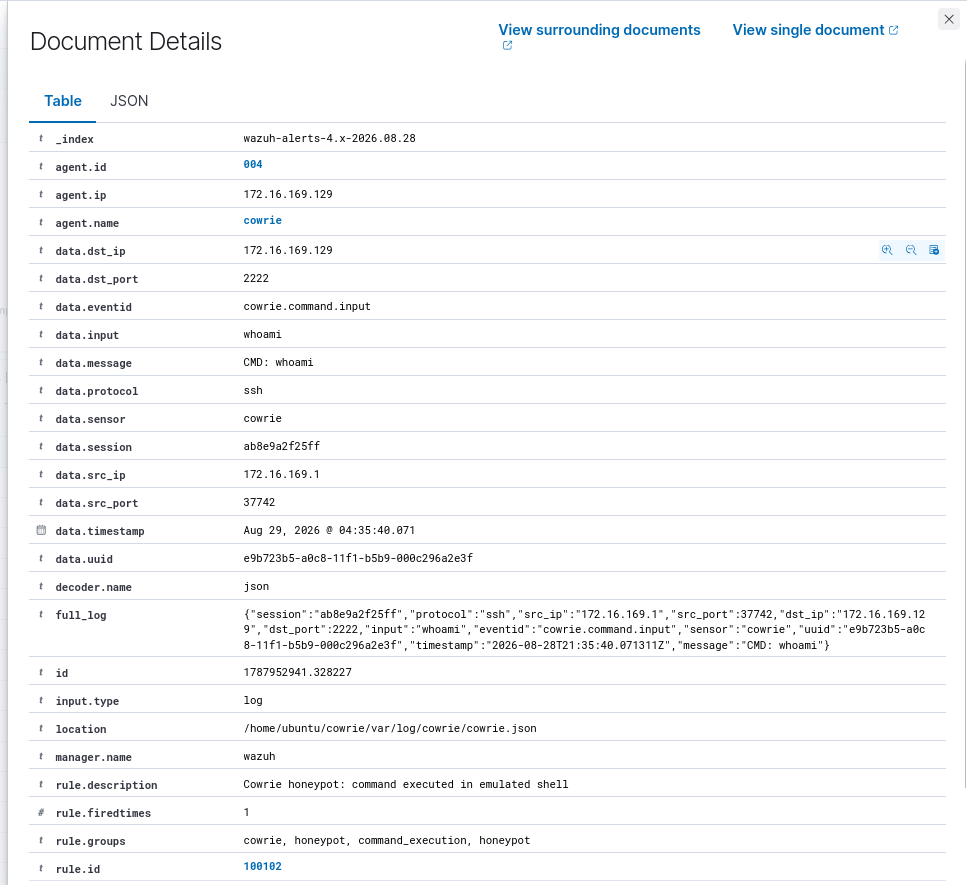
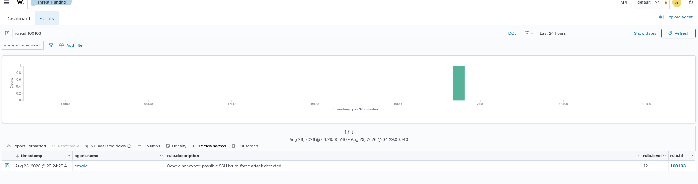
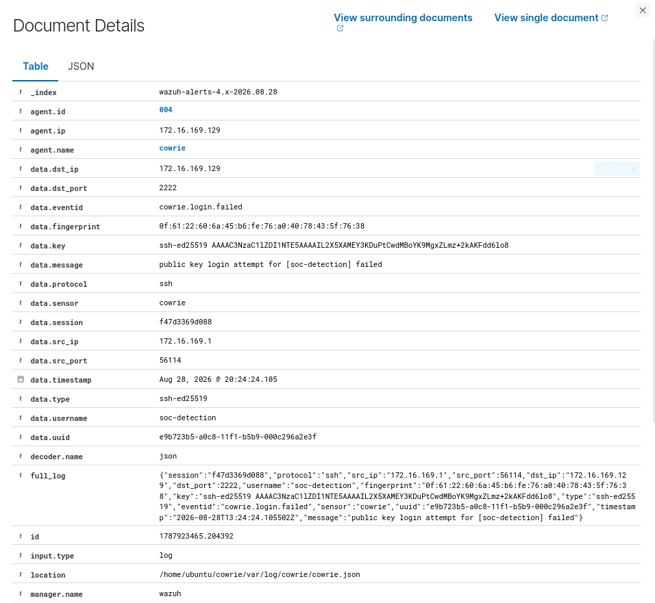

# Blue Team Lab — Cowrie + Wazuh

> Hands-on Blue Team lab demonstrating SSH attack simulation, honeypot telemetry, detection, event correlation, alerting, and tested IP containment.

## Overview

This project demonstrates a practical Blue Team workflow using:

- **Kali Linux** — attacker and attack simulation
- **Cowrie** — SSH/Telnet honeypot
- **Wazuh** — detection, correlation, alerting, and response
- **iptables** — source IP containment

The lab focuses on capturing attacker activity with Cowrie, analyzing the resulting telemetry with Wazuh, and validating a response mechanism that can block the attacker source IP.

## Architecture



```text
Kali Linux
   |
   | SSH attack
   v
Cowrie Honeypot
   |
   | JSON telemetry
   v
Wazuh Agent
   |
   v
Wazuh Manager
   |
   +--> Detection
   +--> Correlation
   +--> Dashboard
   |
   v
Wazuh Active Response
   |
   v
iptables / Firewall
   |
   v
Source IP blocked
```

## Detection Flow

```text
Collect
  |
  v
Cowrie JSON telemetry
  |
  v
Wazuh Agent
  |
  v
Custom Wazuh Rules
  |
  v
Detection / Correlation
  |
  v
Alert
  |
  v
Active Response
  |
  v
Firewall Containment
```

## Attack Scenarios

### 1. Successful SSH Login

A successful SSH login against the Cowrie honeypot is captured and classified by Wazuh rule `100100`.

### 2. Command Execution

After authentication, commands executed inside the Cowrie emulated shell are captured as Cowrie command events and detected by rule `100102`.

### 3. SSH Brute Force

Repeated failed SSH authentication attempts from the same source IP are correlated by Wazuh rule `100103`.

## Detection Rules

| Rule | Detection | Level | Logic |
|---|---|---:|---|
| `100100` | Successful SSH login | 8 | Matches `cowrie.login.success` |
| `100101` | Failed SSH login | 7 | Matches `cowrie.login.failed` |
| `100102` | Command execution | 7 | Matches `cowrie.command.input` |
| `100103` | SSH brute-force correlation | 12 | 3 failed-login events from the same `src_ip` within 60 seconds |

The validated rule set is available in [`detection/rules-cowrie.xml`](detection/rules-cowrie.xml).

## Data Collection

Cowrie writes JSON telemetry to its log file. The Wazuh Agent on the Cowrie VM monitors that file through `<localfile>`:

```xml
<localfile>
  <log_format>json</log_format>
  <location>/home/ubuntu/cowrie/var/log/cowrie/cowrie.json</location>
</localfile>
```

See [`setup/cowrie-log-collection.md`](setup/cowrie-log-collection.md).

## Active Response

Rule `100103` is connected to the Wazuh Active Response mechanism:

```xml
<active-response>
  <disabled>yes</disabled>
  <command>cowrie-firewall-drop</command>
  <location>local</location>
  <rules_id>100103</rules_id>
  <timeout>300</timeout>
</active-response>
```

Response path:

```text
SSH brute-force activity
        |
        v
Wazuh Rule 100103
        |
        v
Wazuh Active Response
        |
        v
cowrie-firewall-drop
        |
        v
iptables
        |
        v
Source IP blocked
```

Automatic blocking is intentionally disabled during routine attack simulation so repeated tests can continue without immediately locking out the attacker.

For the containment demonstration, Active Response is enabled to verify that the detected source IP can be blocked through the firewall. The firewall state is restored after testing.

See [`response/active-response.md`](response/active-response.md).

## Evidence

### Successful SSH Detection — Rule 100100



### Command Execution — Rule 100102





### Brute-Force Correlation — Rule 100103



### Raw Cowrie Event



## Validation

| Test | Result |
|---|---|
| Successful SSH detection | Passed |
| Command execution detection | Passed |
| Brute-force correlation | Passed |
| Active Response containment | Passed |
| Firewall cleanup after testing | Passed |

See [`validation/validation-results.md`](validation/validation-results.md).

## Repository Structure

```text
blue-team-soc-cowrie-wazuh/
├── architecture/
├── detection/
├── evidence/
├── response/
├── scenarios/
├── setup/
├── validation/
├── README.md
├── SECURITY.md
└── .gitignore
```

## Security Notes

Do not commit:

- passwords
- API keys
- tokens
- private keys
- `.env` files
- other sensitive credentials

Credentials exposed during development should be rotated before publishing.

## Project Status

**Status:** Completed and validated

**Focus:** Cowrie telemetry, Wazuh detection, event correlation, alerting, and tested IP containment.
